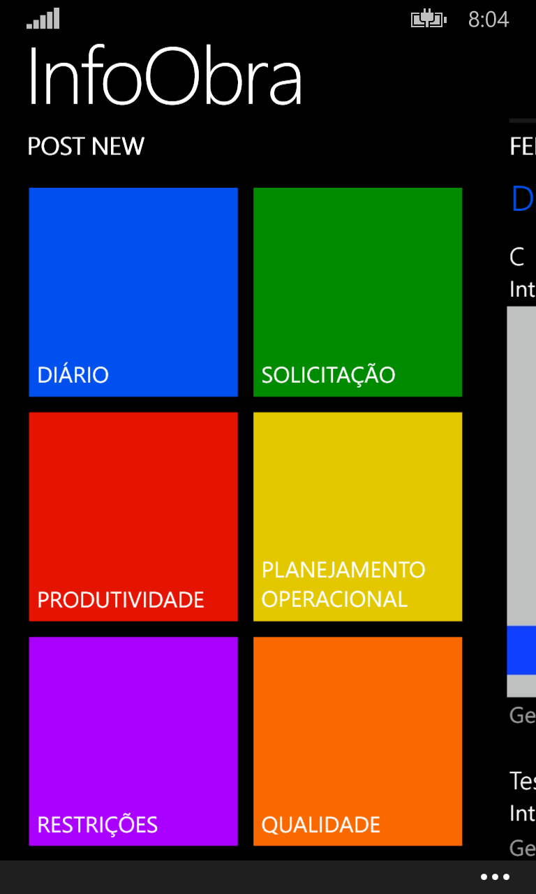
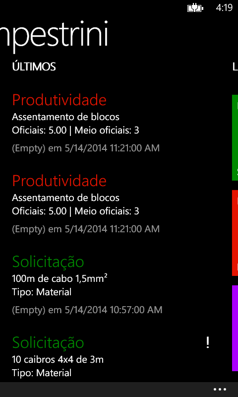
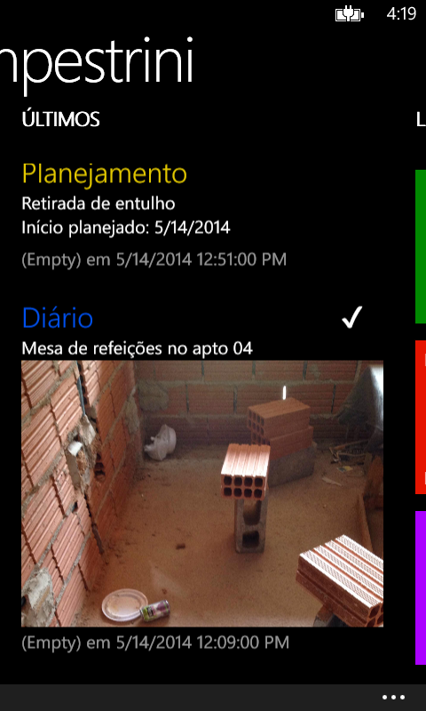
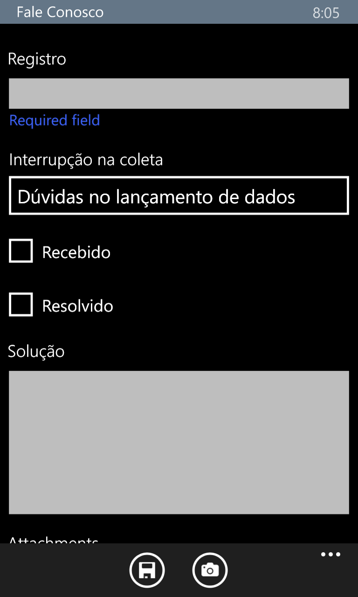
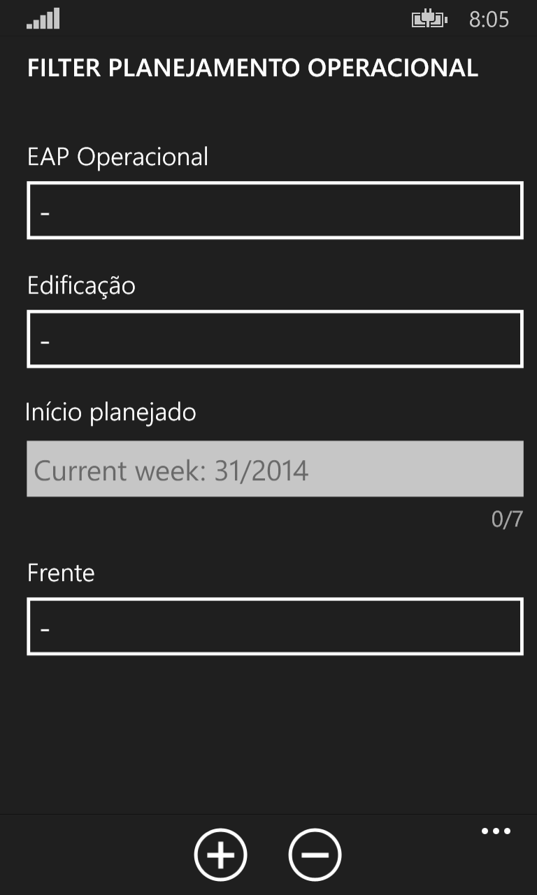
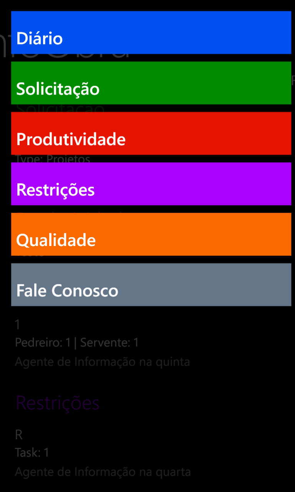

# InfoObra

App Windows Phone para coleta de dados, monitoramento do canteiro de obras e comunicação entre a obra e o escritório central. Tem como motivação tornar o diário de obras numa ferramenta digital, de mais fácil controle e operação. Também coleta e armazena dados de obra para análises futuras.

Funcionalidades:

Cadastro de solicitações de obra, dados de produtividade, planejamento, qualidade e informações diversas do diário; coleta de fotos da obra; feed filtrável por áreas com as últimas postagens; envio das informações a um servidor SharePoint.

 

  
  
  
  
  
  

  <i>Desenvolvido por Rodrigo Chin. 2014</i>

